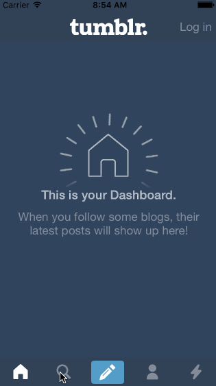

# TumblrDemo

This is an iOS demo application which shows a walkthrough of a custom tab bar.

Time spent: 3 hours spent in total

Completed:

* [x] Tapping on Home, Search, Account, or Trending should show the respective screen and highlight the tab bar button.
* [x] Compose button should modally present the compose screen.

Not completed:

* [ ] Optional: Compose screen is faded in while the buttons animate in.
* [ ] Optional: Login button should show animate the login form over the view controller.
* [ ] Optional: Discover bubble should bob up and down unless the SearchViewController is tapped.

Walkthrough:

